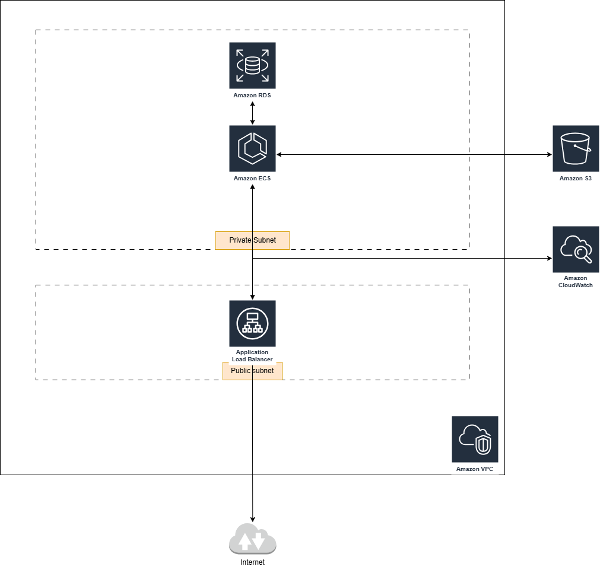

I have created a folder named terraform, in that I have added the infrastructure code,
To comply with scalability, reliability, efficiency following things were done,

1. Utilized modules to create services for better reusability
2. Added two separate variable files under the `terraform/environments` folder, to track the state file of dev and prod environment separately
3. Utilized Github actions to offload the repetative cmd executions for building, planning, deploying
4. Stored the database password in Github env variable and passed to the pipeline, not using secrets manager since the application requires the credentials via env variables
5. Used github commit sha as the tag for ecr images for better tracking
6. The piepline has three jobs, build, plan, apply. In an real environment separate jobs for both dev and prd running in separate tagged runners in used.
7. Used delete protection to the resources like DB, and ALB

To run in local use the following steps,

1. `aws configure` to configure access and secret keys of AWS account with necessary permissions to deploy the service
2. `terraform init -reconfigure -backend-config="environments/dev/backend.hcl"`
2. `terraform plan -var-file="environments/dev/dev.tfvars" -var="image_tag=dbcb038cd1290b6a56ed25f08ca08f8ffbbb4aea"        -var="database_password=xxxxxxxx" -out="dev.tfplan"` # password should no lesser than 8 chars
3. `terraform apply -auto-approve -var-file="environments/dev/dev.tfvars" -var="image_tag=dbcb038cd1290b6a56ed25f08ca08f8ffbbb4aea" -var="database_password=xxxxxxxx"` # password should no lesser than 8 chars

To run in Github actions, 

1. Set the access and secret key of AWS service account in Github secrets
2. Run terraform plan stage with latest git commit sha of the repo
3. Once the plan is success, use the same git commit sha for the terraform deploy stage

